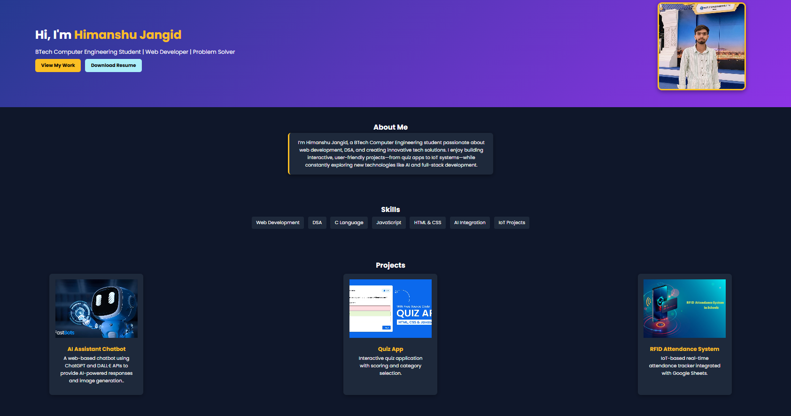

# Himanshu Jangid - Portfolio 🚀

Personal portfolio website showcasing my skills as a BTech Computer Engineering student and web developer.


## ✨ Features
- Responsive design for all devices
- Modern UI with clean animations
- Resume download functionality
- Interactive project showcase
- Contact integration

## 🛠️ Tech Stack
- HTML5, CSS3, JavaScript
- Google Fonts (Poppins)
- Responsive Web Design

## 🚀 Quick Start
```bash
git clone https://github.com/himanshujangid/portfolio.git
cd portfolio
open index.html
```

## 🎨 Projects Featured
- **AI Assistant Chatbot** - ChatGPT & DALL·E API integration
- **Quiz App** - Interactive quiz with scoring system  
- **RFID Attendance System** - IoT-based attendance tracker

## 💼 Skills
Web Development | DSA | C Language | JavaScript | AI Integration | IoT Projects

## 📞 Contact
- 📧 [jangidhj28@gmail.com](mailto:jangidhj28@gmail.com)
- 💼 [LinkedIn](https://linkedin.com/in/himanshujangid1227)
- 🐙 [GitHub](https://github.com/himanshujangid)

## SCREENSHOT

