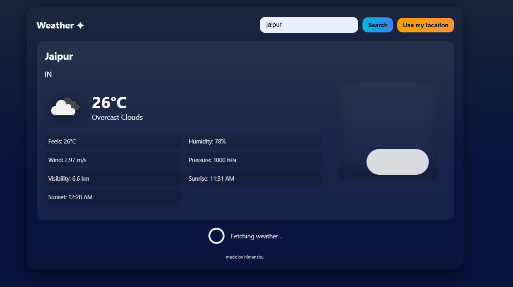

# 🌦️ Weather App

## 📌 
This repository contains the implementation of a **Weather App** that fetches and displays real-time weather data for any city using an external API.

---

## 🎯 Objective
The main objective of this project is to build a **simple and user-friendly weather application** that:  
- Takes a city name as input.  
- Fetches live weather data using a weather API.  
- Displays details like **temperature, humidity, wind speed, and weather conditions**.  

---

## ⚙️ Steps Performed
1. Designed the frontend using **HTML, CSS, and JavaScript**.  
2. Integrated a **Weather API** (e.g., OpenWeatherMap API) for real-time data.  
3. Used **fetch API** to make HTTP requests and handle responses.  
4. Implemented input validation to ensure proper city search.  
5. Styled the app for a clean and modern user interface.  
6. Tested the application for multiple cities to ensure accuracy.  

---

## 🛠️ Tools & Technologies Used
- **Frontend:** HTML, CSS, JavaScript  
- **API:** OpenWeatherMap API (or any weather API used)  
- **IDE/Editor:** VS Code  
- **Version Control:** Git & GitHub  

---

## 🚀 Outcome
- Successfully developed a **real-time weather application**.  
- Users can quickly check weather conditions of any city.  
- Improved understanding of **API integration** and **JavaScript fetch handling**.  

---

## 📸 Demo Screenshots
 
  

---

## 👨‍💻 Author
**Name:** Himanshu Jangid  
**Email:** jangidhj28@gmail.com  

---
